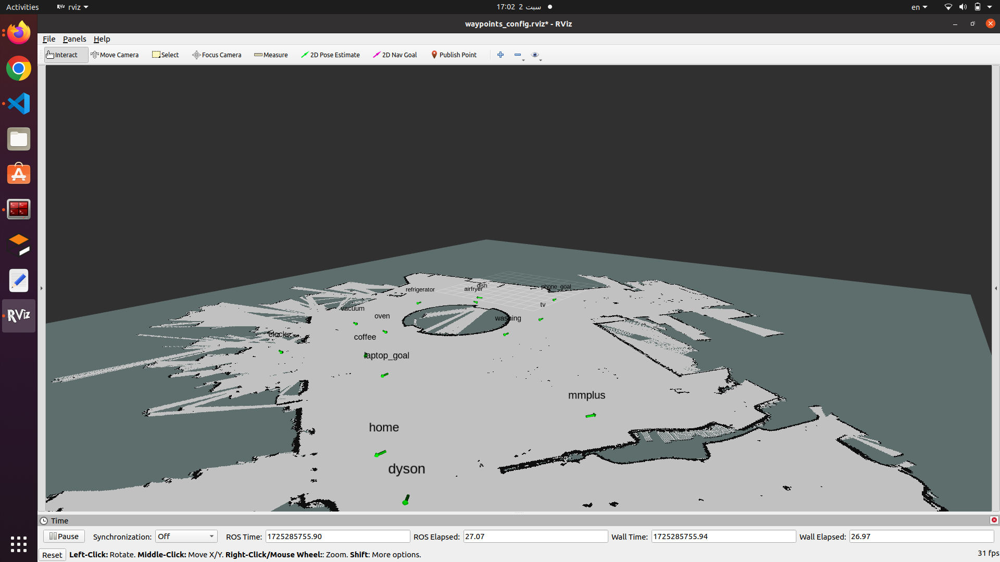

## Running the Solution and Visualizing Waypoints in RViz

### Prerequisites

- **ROS Installation** : Ensure you have ROS (Noetic) installed on your system.
- `jsoncpp` library should be installed and configured in your workspace.

### Step-by-Step Instructions

#### **Clone the Repository**

Start by cloning the repository that contains the waypoint marker publisher

```bash
git clone https://github.com/arche-robotics-internship/waypoints-marker.git
```

#### **Install Dependencies**

Ensure all required dependencies are installed, specifically `jsoncpp` for handling JSON files.

Install it using the following command

```bash
sudo apt-get install libjsoncpp-dev  
```

#### **Build the Workspace**

Navigate to the workspace root and build the workspace.

```bash
catkin_make
source devel/setup.bash
```

#### Launch the Waypoint Marker Publisher

To start the waypoint marker publisher and RViz, use the appropriate launch file based on your needs:

##### 1. With Map Server

If you need to load a map using the `map_server`, use the following launch file:

```bash
roslaunch waypoints_marker_publisher markers_map.launch
```

This launch file:

* Starts the waypoint marker publisher node.
* Loads a map using the `map_server` with the specified YAML map file.
* Optionally opens RViz with a predefined configuration file (`waypoints_config.rviz`).

#### 2. Without Map Server

For field use, where the map is already loaded and you only need to run the waypoint marker publisher node, use this launch file:

```bash
roslaunch waypoints_marker_publisher markers.launch
```

This launch file:

* Starts the waypoint marker publisher node.
* Does not launch the `map_server`, assuming the map is already loaded or not needed.



This image illustrates how the waypoints appear in  he loaded map inRViz.

## Brief Report on Testing and Challenges Encountered

#### Testing Process

1. **Environment Setup:**
   The initial setup involved configuring the ROS workspace and ensuring
   all dependencies were installed, including ROS Noetic, RViz, and the `jsoncpp` library.
2. **JSON File Validation:**
   The JSON file containing the waypoints (`waypoints.json`) was validated to ensure it was correctly formatted. This included checking the syntax and ensuring all required fields (`name`, `x`, `y`, `z`, `mall`) were included.
3. **Node Execution:**
   The `waypoints_marker_publisher` node was executed to test the correct reading of the JSON file and the publishing of marker messages to the `/visualization_marker` topic.
4. **RViz Visualization:**
   RViz was used to visualize the published markers. The setup was tested
   to ensure markers were displayed correctly in the desired frame (`map`) and that text markers for the mall names were positioned accurately above each waypoint.

#### Challenges Encountered

1. **JSON Library Errors** : This was the first time using JSON files with ROS, which required dealing with the `jsoncpp`
   library and configuring it properly. The challenge involved ensuring
   the JSON library was correctly integrated and the file handling was
   accurate.
